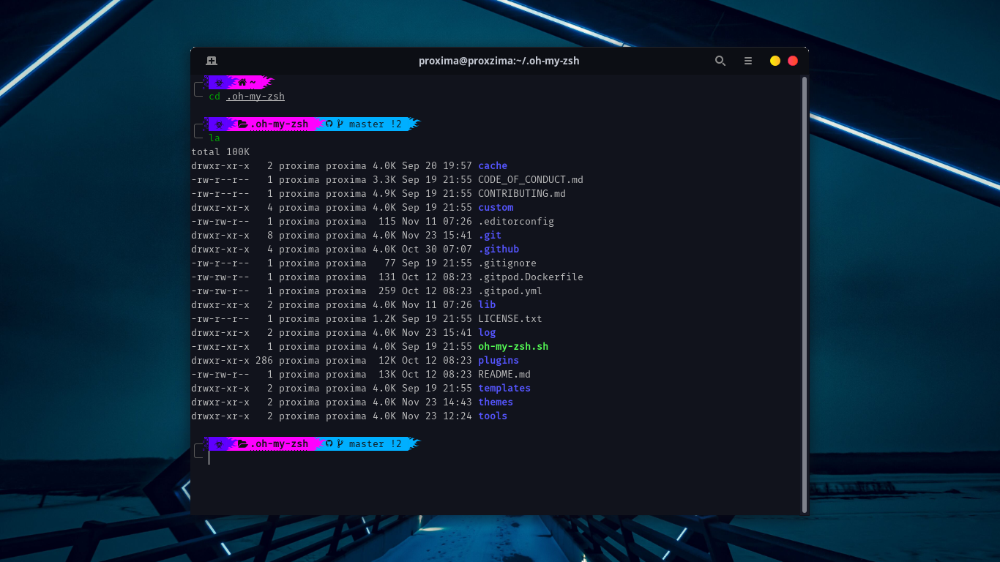

# Instruction

Refer [romkatv/powerlevel10k](https://github.com/romkatv/powerlevel10k#oh-my-zsh) for powerlevel10k installation for OMZ.

1) Extract <b><i>p10k</i></b>. You'll get a file with name <b><i>.p10k.zsh</i></b> which will be the powerlevel theme.

2) Copy <b><i>.p10k.zsh</i></b> to home your folder ~/

<i>Note:</i> While powerlevel installation, if you configure your own ~/.p10k.zsh then simply rename it before copying above one.

3) Restart Terminal

